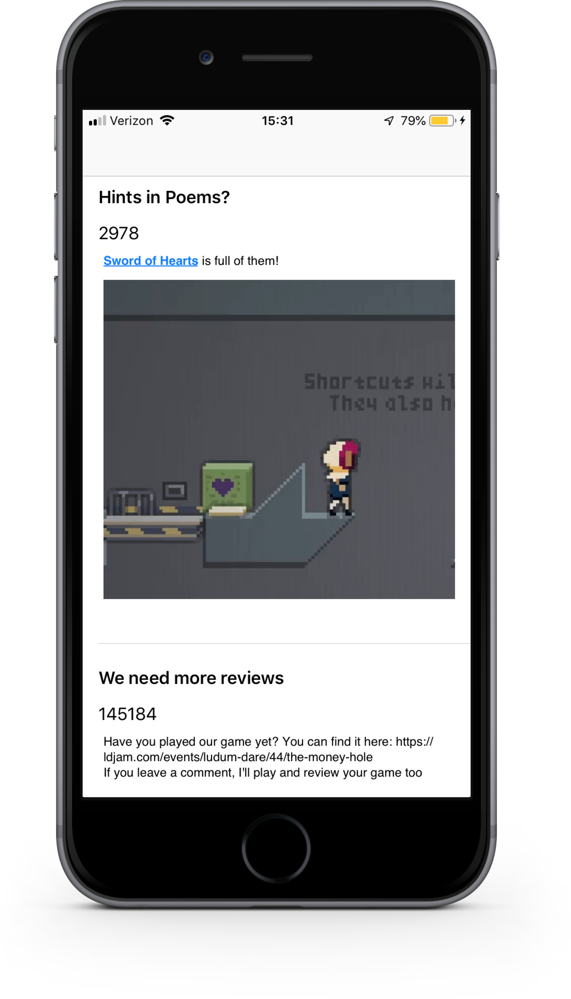
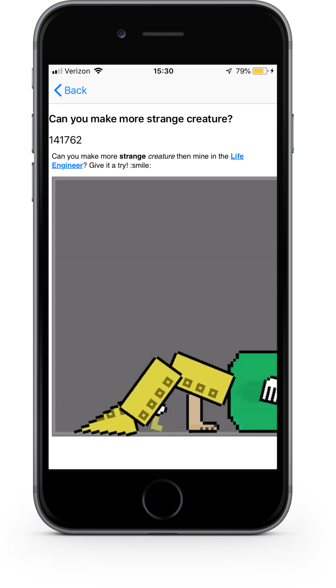

# Ludum Dare iOS Client

An iOS client for ldjam.com

# Current Status

The app currently only supports feed scrolling.  Post rendering is done with a UITextView and an NSAttributedString.  This will be changed since images do not follow autolayout constraints and extend past the edges of the screen if too large.

# Screenshots

# Features

- [X] View 10 Most Recent Post Titles and Author Ids
- [ ] Render Post Body
- [ ] Infinite Feed Scrolling
- [ ] Login
  - [ ] Comment on Posts
  - [ ] Like Posts 
- [ ] Theme Voting
- [ ] Date Notifications
- [ ] Jam Countdown
